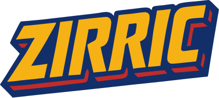

# [](https://zirric.knabel.dev)

Zirric is an experimental programming language with a reference implementation in Go. The project is in an early stage and offers the essential building blocks of a modern language:

- Documentation site: https://zirric.knabel.dev
- Lexer, parser, and AST
- Analyzer for symbol resolution and ID assignment
- Bytecode compiler and virtual machine
- Standard library with prelude types such as `Array`, `Bool`, `Int`, and `String`
- Package management via `Cavefile` and registries
- Documentation on syntax, types, and style in [`docs/`](./docs)
- Language evolution proposals in [`docs/proposals/`](https://zirric.knabel.dev/proposals), with the base language in [`docs/proposals/ZE-001-base-language.md`](https://zirric.knabel.dev/proposals/ZE-001-base-language)
- Core language surface in the Zirric sources under [`prelude/`](./prelude) and [`future/`](./future)

## Language overview

A quick glimpse at core features.
More details are available in the [language documentation](https://zirric.knabel.dev).

### Variables, functions, and data types

```zirric
let answer = 42
let items = [1, 2, 3]

fn greet(name) {
    "Hello, " + name
}

data Person {
    name
    age
}

let alice = Person("Alice", 30)
print(greet(alice.name))
```

### Control flow

Zirric provides both expression and statement variants of `if` and `for`.
The examples below use the expression forms, which yield values and can be
nested inside other expressions.

```zirric
let message = if answer == 42 { "yes" } else { "no" }

for item <- items {
    print(item)
}
```

When only side effects are required, use the statement forms, which run for
their effects and produce no value:

```zirric
if answer == 42 {
    print("yes")
} else {
    print("no")
}

for item -> items {
    print(item)
}
```

An empty `for { }` forms an infinite loop, useful for servers or event
processors. It runs forever and only terminates when a `break` statement is
encountered.

### Unions

```zirric
union Result {
    data Ok { value }
    data Err { message }
}

let r = Ok(42)
```

### Attributes

Zirric has no interfaces; instead, attributes attach behaviour and metadata to
types and functions. They enable generic code to rely on declared capabilities
without a formal interface system:

```zirric
attr Countable {
    @Returns(Int)
    length(@Has(Countable) value)
}

@Countable({ v -> v.length })
data Bag {
    items
    length
}
```

Here `Countable` supplies a `length` implementation, allowing tools to treat
`Bag` like any other countable collection.

### Cavefile manifests

Cavefiles are Zirric sources that declare dependencies and tasks via attributes:

```zirric
import future.cave
import future.tasks

@cave.Dependencies()
data Dependencies {
    @cave.Stdlib("prelude")
    prelude
}

@tasks.Name("generate")
@tasks.Exec("tasks/generate.zirr")
data GenerateTask {}
```

## License

This project is licensed under the [Mozilla Public License 2.0](LICENSE).
